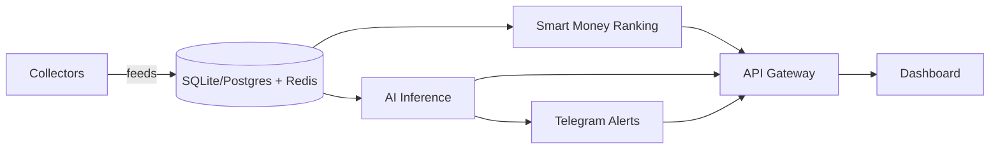

# HyperPulse

AI-powered intelligence platform for Hyperliquid traders.

HyperPulse provides whale tracking, smart money analysis, liquidation radar, and AI-generated market insights — focused on understanding trader behavior, inferred strategies, and market context.

---

## Phase Status

| Phase | Feature | Status | Route / API |
|-------|---------|--------|-------------|
| 1 | Whale Alerts | Done | `/whale-alerts`, `/api/v1/whale-alerts` |
| 1 | Trader Profiles | Done | `/traders`, `/api/v1/traders` |
| 1 | Liquidation Radar | Done | `/liquidations`, `/api/v1/liquidations/*` |
| 1 | Dashboard Overview | Done | `/` |
| 2 | AI Strategy Inference | Done | `/insights`, `/api/v2/inferences` |
| 2 | Smart Money Ranking | Done | `/rankings`, `/api/v2/rankings` |
| 2 | Telegram Alerts | Done | `/alerts`, `/api/v2/alerts` |
| 2 | Collectors + Persistence | Done | `/api/v2/pipeline/status` |

Phase 2 runs a background pipeline: collectors → store/DB → ranking → AI inference → Telegram alerts.

Without API keys, inference uses a heuristic classifier and alerts are queued locally.

---

## Quick Start

### Prerequisites

- Node.js 20+
- Python 3.12+
- Docker (optional, for PostgreSQL/Redis)

### 1. Clone & configure

```bash
git clone https://github.com/dasvayda/HyperPulse.git
cd HyperPulse
cp .env.example .env
```

### 2. Backend

```bash
cd backend
python -m venv .venv
# Windows
.venv\Scripts\activate
# macOS/Linux
source .venv/bin/activate

pip install -r requirements.txt
uvicorn app.main:app --reload --port 8000
```

API docs: http://localhost:8000/docs

### 3. Frontend

```bash
cd frontend
npm install
npm run dev
```

Dashboard: http://localhost:3000

### Docker (full stack)

```bash
docker compose up --build
```

---

## Project Structure

```
HyperPulse/
├── frontend/          # Next.js 15 + TypeScript + Tailwind
├── backend/           # FastAPI + collectors + AI services
├── docs/              # Architecture docs
├── docker-compose.yml
├── agent.md
└── .env.example
```

---

## Phase 2 Architecture



| Component | Path | Notes |
|-----------|------|-------|
| Collectors | `backend/app/collectors/` | Hyperliquid meta API + simulated trader ticks |
| Store/ORM | `backend/app/services/store.py`, `models/orm.py` | SQLite by default |
| Ranking | `backend/app/services/ranking.py` | Win rate + momentum + consistency |
| Inference | `backend/app/services/inference.py` | OpenAI / DeepSeek / heuristic |
| Alerts | `backend/app/services/alerts.py` | Telegram or local queue |

---

## Design

Nansen-inspired dark FinTech dashboard:

- Background: `#0b0e11`
- Accent: `#00ffa3` (neon mint)
- Data tables with inline sparkline bars
- Sidebar navigation with active state highlights

---

## Tech Stack

| Layer | Stack |
|-------|-------|
| Frontend | Next.js, TypeScript, Tailwind CSS |
| Backend | FastAPI, Python, SQLAlchemy |
| Database | SQLite (default), PostgreSQL optional |
| Cache | Redis optional (memory fallback) |
| AI | OpenAI, DeepSeek, heuristic fallback |
| Alerts | Telegram Bot API |
| Infra | Docker, Railway, AWS |

---

## API Endpoints

### Phase 1 (`/api/v1`)

| Method | Path | Description |
|--------|------|-------------|
| GET | `/api/v1/dashboard/stats` | Dashboard summary |
| GET | `/api/v1/whale-alerts` | Whale entry/exit alerts |
| GET | `/api/v1/traders` | Top trader profiles |
| GET | `/api/v1/traders/{address}` | Trader detail |
| GET | `/api/v1/liquidations/zones` | Liquidation zone clusters |
| GET | `/api/v1/liquidations/events` | Recent liquidation events |

### Phase 2 (`/api/v2`)

| Method | Path | Description |
|--------|------|-------------|
| GET | `/api/v2/rankings` | Smart money ranking |
| GET | `/api/v2/insights` | AI market insights |
| GET | `/api/v2/inferences` | Strategy classifications |
| GET | `/api/v2/alerts` | Telegram alert history |
| GET | `/api/v2/pipeline/status` | Collector/inference status |
| POST | `/api/v2/pipeline/run` | Force one pipeline cycle |

---

## Environment

Key Phase 2 variables (see `.env.example`):

```bash
OPENAI_API_KEY=
DEEPSEEK_API_KEY=
TELEGRAM_BOT_TOKEN=
TELEGRAM_CHAT_ID=
AI_PROVIDER=auto
COLLECTOR_ENABLED=true
```

---

## Roadmap

**Phase 1** — Whale Alert, Trader Profiles, Basic Liquidation Radar

**Phase 2** — AI Strategy Inference, Smart Money Ranking, Telegram Alerts

**Phase 3** — Personalized AI Trading Coach, Portfolio Intelligence, Predictive Analytics

See [docs/ARCHITECTURE.md](docs/ARCHITECTURE.md) for system design.

---

## License

MIT
