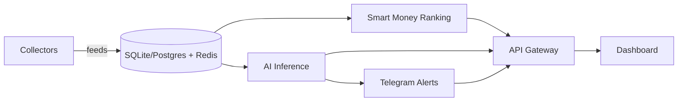

# HyperPulse

AI-powered intelligence platform for Hyperliquid traders.

HyperPulse provides whale tracking, smart money analysis, liquidation radar, and AI-generated market insights — focused on understanding trader behavior, inferred strategies, and market context.

---

## Product Goals

HyperPulse is **not** a historical data warehouse or a paid raw-data API business.

**North star:** deliver a **strong insight for the current moment** — something a trader can use on the next decision, not a dense archive to explore.

### What we optimize for

| Principle | Meaning |
|-----------|---------|
| Now > history | Prefer live whale bias, open positions, funding/liq skew, and actionable stance over long backfill charts |
| Simple > exhaustive | Few trustworthy signals beat many competing metrics |
| Reliable > novel | Every number should be explainable from Hyperliquid state we collect ourselves |
| Actionable > decorative | UI and alerts should answer *what matters now* and *what to do / watch* |
| Interpretation > dump | AI/heuristics turn metrics into short insight (buy/sell/hold, risk, style) — not another spreadsheet |

### What we deliberately avoid

- Selling accumulated datasets or competing as a full-market data vendor
- Dense scanner UIs that surface every cohort, window, and sparkline by default
- Metrics we cannot verify or that exist only to look “complete”
- Feature sprawl that dilutes trust in the few signals we do show

Persistence still exists (alerts, traders, snapshots) for product continuity — it is a **means**, not the product.

Design implications are documented in [docs/ARCHITECTURE.md](docs/ARCHITECTURE.md#product-goals--design-constraints).

Feature backlog (benchmark + checklist): [docs/PRODUCT_BACKLOG.md](docs/PRODUCT_BACKLOG.md).

Public launch gates and rollout criteria: [docs/LAUNCH_PLAN.md](docs/LAUNCH_PLAN.md). Feature completion does not by itself mean production readiness.

Solo repo: ship finished work on `main` (see [AGENTS.md](AGENTS.md)). PRs are not a review gate.

---

## Phase Status

| Phase | Feature | Status | Route / API |
|-------|---------|--------|-------------|
| 1 | Whale Alerts | Done | `/whale-alerts`, `/api/v1/whale-alerts` |
| 1 | Trader Profiles | Done | `/traders`, `/api/v1/traders` |
| 1 | Liquidation Radar | Done | `/liquidations`, `/api/v1/liquidations/*` |
| 1 | Dashboard Overview | Done | `/` |
| 2 | AI Strategy Inference | Done | `/insights`, `/api/v2/inferences` |
| 2 | Smart Money Ranking | Done | `/rankings`, `/api/v2/rankings` |
| 2 | Telegram Alerts | Done | `/alerts`, `/api/v2/alerts` |
| 2 | Collectors + Persistence | Done | `/api/v2/pipeline/status` |
| 2 | Paper Portfolio | Shadow validation | `/performance`, `/api/v2/paper-portfolio/*` |
| Launch | Public production readiness | In progress | [Launch Plan](docs/LAUNCH_PLAN.md) |

Phase 2 runs a background pipeline: collectors → store/DB → ranking → AI inference → Telegram alerts.

Without API keys, inference uses a heuristic classifier and alerts are queued locally.

---

## Quick Start

### Prerequisites

- Node.js 20+
- Python 3.12+
- Docker (optional, for PostgreSQL/Redis)

### 1. Clone & configure

```bash
git clone https://github.com/dasvayda/HyperPulse.git
cd HyperPulse
cp .env.example .env
```

### 2. Backend

```bash
cd backend
python -m venv .venv
# Windows
.venv\Scripts\activate
# macOS/Linux
source .venv/bin/activate

pip install -r requirements.txt
uvicorn app.main:app --reload --port 8000
```

API docs: http://localhost:8000/docs

Liveness: `GET /health`. Deployment readiness: `GET /health/ready` returns
per-dependency DB, cache, and collector state; it returns `503` when the DB or
collector is not ready.

### 3. Frontend

```bash
cd frontend
npm install
npm run dev
```

Dashboard: http://localhost:3100

### Docker (development)

```bash
docker compose up --build
```

The development stack mounts source code and runs the backend/frontend dev servers.

### Docker (production-like)

Set a strong `POSTGRES_PASSWORD` and the exact public frontend origin in
`CORS_ORIGINS`, then run:

```bash
docker compose -f docker-compose.prod.yml up --build -d
```

The production stack builds the Next.js standalone server, runs Uvicorn
without reload, keeps PostgreSQL/Redis off host ports, and waits for container
healthchecks before starting dependants.

For the production deployment preflight, smoke checks, and source-ref rollback
procedure, see [Deployment Runbook](docs/DEPLOYMENT_RUNBOOK.md). Do not use the
pipeline-run endpoint as a deployment smoke test because it can create real
alert candidates.

---

## Project Structure

```
HyperPulse/
├── frontend/          # Next.js 15 + TypeScript + Tailwind
├── backend/           # FastAPI + collectors + AI services
├── docs/              # Architecture docs
├── docker-compose.yml
├── docker-compose.prod.yml
├── AGENTS.md
└── .env.example
```

---

## Phase 2 Architecture


```mermaid
flowchart LR
  Collectors[Collectors] -->|feeds| Storage[(SQLite/Postgres + Redis)]
  Storage --> Ranking[Smart Money Ranking]
  Storage --> AIInference[AI Inference]
  AIInference --> Alerts[Telegram Alerts]
  Ranking --> API[API Gateway]
  AIInference --> API
  Alerts --> API
  API --> Frontend[Dashboard]
```

| Component | Path | Notes |
|-----------|------|-------|
| Collectors | `backend/app/collectors/` | Hyperliquid meta API + simulated trader ticks |
| Store/ORM | `backend/app/services/store.py`, `models/orm.py` | SQLite by default |
| Ranking | `backend/app/services/ranking.py` | Win rate + momentum + consistency |
| Inference | `backend/app/services/inference.py` | OpenAI / DeepSeek / heuristic |
| Alerts | `backend/app/services/alerts.py` | Telegram or local queue |

---

## Design

Nansen-inspired dark FinTech dashboard:

- Background: `#0b0e11`
- Accent: `#00ffa3` (neon mint)
- Data tables with inline sparkline bars
- Sidebar navigation with active state highlights

---

## Tech Stack

| Layer | Stack |
|-------|-------|
| Frontend | Next.js, TypeScript, Tailwind CSS |
| Backend | FastAPI, Python, SQLAlchemy |
| Database | SQLite (default), PostgreSQL optional |
| Cache | Redis optional (memory fallback) |
| AI | OpenAI, DeepSeek, heuristic fallback |
| Alerts | Telegram Bot API |
| Infra | Docker, Railway, AWS |

---

## API Endpoints

### Phase 1 (`/api/v1`)

| Method | Path | Description |
|--------|------|-------------|
| GET | `/api/v1/dashboard/stats` | Dashboard summary |
| GET | `/api/v1/whale-alerts` | Whale entry/exit alerts |
| GET | `/api/v1/traders` | Top trader profiles |
| GET | `/api/v1/traders/{address}` | Trader detail |
| GET | `/api/v1/liquidations/zones` | Liquidation zone clusters |
| GET | `/api/v1/liquidations/events` | Recent liquidation events |

### Phase 2 (`/api/v2`)

| Method | Path | Description |
|--------|------|-------------|
| GET | `/api/v2/rankings` | Smart money ranking |
| GET | `/api/v2/insights` | AI market insights |
| GET | `/api/v2/inferences` | Strategy classifications |
| GET | `/api/v2/alerts` | Telegram alert history |
| GET | `/api/v2/alerts/summary` | Telegram delivery results in the last 24 hours |
| GET | `/api/v2/pipeline/status` | Collector/inference status |
| GET | `/api/v2/insights/brief` | Market or coin-scoped Market Brief |
| GET | `/api/v2/whale-book/liq-proximity` | Tracked positions near actual liquidation price |
| GET | `/api/v2/paper-portfolio/summary` | `$1,000` forward-test summary |
| GET | `/api/v2/paper-portfolio/equity` | Paper NAV and benchmark history |
| GET | `/api/v2/paper-portfolio/trades` | Completed paper trades |
| POST | `/api/v2/pipeline/run` | Force one pipeline cycle |

---

## Environment

Key Phase 2 variables (see `.env.example`):

```bash
OPENAI_API_KEY=
DEEPSEEK_API_KEY=
TELEGRAM_BOT_TOKEN=
TELEGRAM_CHAT_ID=
AI_PROVIDER=auto
COLLECTOR_ENABLED=true
```

`POST /api/v2/pipeline/run` is an operator endpoint. In `production`, `prod`, or
`staging`, set `PIPELINE_RUN_TOKEN` and send it in the `X-Pipeline-Token` header.
The endpoint returns `503` instead of running when the token is not configured.

Set `NEXT_PUBLIC_TELEGRAM_CHANNEL_URL` to a Telegram public-channel or private-invite
URL to show the beta join button on `/alerts`.

Set `PUBLIC_APP_URL` to the public frontend origin after HTTPS is configured. Telegram
alerts then include a link to the relevant trader, liquidation, or Market Brief screen.

---

## Roadmap

**Phase 1** — Whale Alert, Trader Profiles, Basic Liquidation Radar

**Phase 2** — AI Strategy Inference, Smart Money Ranking, Telegram Alerts

**Phase 3** — Personalized AI Trading Coach, Portfolio Intelligence, Predictive Analytics

See [docs/ARCHITECTURE.md](docs/ARCHITECTURE.md) for system design.

---

## License

MIT
