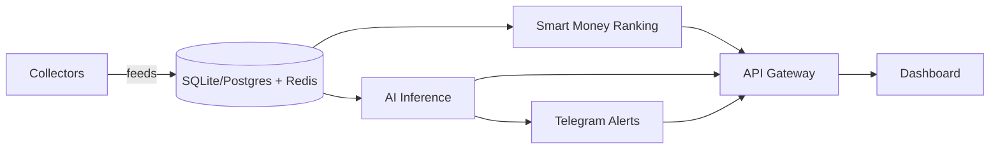

# HyperPulse Architecture

## Overview

HyperPulse is a data intelligence platform built on top of Hyperliquid.

The system continuously collects trading activities, market signals, and liquidation events.

AI services generate insights and inferred trader strategies.

---

# High-Level Architecture

                    ┌─────────────────┐
                    │ Hyperliquid API │
                    └────────┬────────┘
                             │
                             ▼

                   ┌──────────────────┐
                   │ Data Collectors  │
                   └────────┬─────────┘
                            │

         ┌──────────────────┼──────────────────┐
         ▼                  ▼                  ▼

 ┌─────────────┐   ┌─────────────┐   ┌─────────────┐
 │ Trader Data │   │ Market Data │   │ Event Data  │
 └──────┬──────┘   └──────┬──────┘   └──────┬──────┘
        │                 │                 │
        └─────────────────┼─────────────────┘
                          ▼

                 ┌─────────────────┐
                 │ PostgreSQL      │
                 └──────┬──────────┘
                        │
                        ▼

                 ┌─────────────────┐
                 │ Feature Engine  │
                 └──────┬──────────┘
                        │
        ┌───────────────┼───────────────┐
        ▼               ▼               ▼

┌─────────────┐ ┌─────────────┐ ┌─────────────┐
│ Whale AI    │ │ Liquidation │ │ Ranking AI  │
│ Engine      │ │ Engine      │ │ Engine      │
└──────┬──────┘ └──────┬──────┘ └──────┬──────┘
       │               │               │
       └───────────────┼───────────────┘
                       ▼

              ┌───────────────────┐
              │ LLM Intelligence  │
              └─────────┬─────────┘
                        │
                        ▼

              ┌───────────────────┐
              │ API Gateway       │
              └─────────┬─────────┘
                        │

       ┌────────────────┼─────────────────┐
       ▼                ▼                 ▼

┌─────────────┐ ┌─────────────┐ ┌─────────────┐
│ Dashboard   │ │ Telegram    │ │ REST API    │
└─────────────┘ └─────────────┘ └─────────────┘

---

# Collector Layer

## Trader Collector

Collect:

- account state
- positions
- fills
- leverage
- realized pnl
- unrealized pnl

Frequency:

- websocket
- 5 second polling fallback

---

## Market Collector

Collect:

- price
- funding
- open interest
- volume
- volatility

Frequency:

- realtime

---

## Liquidation Collector

Collect:

- liquidation events
- liquidation size
- liquidation side

Frequency:

- realtime

---

# Database Schema

## traders

| field | type |
|---------|---------|
| address | text |
| pnl | numeric |
| win_rate | float |
| rank | integer |

---

## positions

| field | type |
|---------|---------|
| trader_id | uuid |
| asset | text |
| side | text |
| entry_price | numeric |
| exit_price | numeric |
| leverage | numeric |

---

## liquidations

| field | type |
|---------|---------|
| asset | text |
| side | text |
| size | numeric |
| timestamp | timestamptz |

---

# Feature Engine

Purpose:

Convert raw events into AI-ready signals.

Examples:

- trader win rate
- average holding time
- risk score
- leverage profile
- strategy profile
- liquidation density
- liquidation clusters

---

# Whale Intelligence Engine

Produces:

- Whale Alerts
- Position Reports
- Trader Profiles

Example Output

Trader: 0x123

Performance

- Win Rate: 72%
- Avg Hold Time: 12h

Behavior

- Momentum trader
- Uses pyramiding
- Prefers ETH and BTC

Confidence Score

81%

---

# Liquidation Engine

Produces:

- Heatmaps
- Cluster Detection
- Squeeze Detection

Signals

- Long squeeze risk
- Short squeeze risk
- High leverage zones

---

# AI Strategy Inference

Inputs

- Position history
- Market conditions
- Funding history
- Open interest

Outputs

- Strategy classification
- Trading style
- Risk profile

Possible classifications

- Momentum
- Trend Following
- Mean Reversion
- Scalping
- Swing Trading
- Funding Arbitrage

---

# Alert System

Supported Channels

- Telegram
- Discord
- Email
- Push Notifications

Triggers

- Whale Entry
- Whale Exit
- Large Liquidation
- Squeeze Risk

---

# MVP Scope

Included

- Top 100 trader tracking
- Whale alerts
- Liquidation radar
- Telegram alerts
- AI summaries

Excluded

- Copy trading
- Portfolio management
- Automated execution

---

# Phase 2 Implementation

Phase 2 wires collectors, persistence, ranking, inference, and alerts into a background pipeline.



## Runtime modules

| Module | Responsibility |
|--------|----------------|
| `app/collectors/hyperliquid.py` | Pull Hyperliquid meta/asset contexts; simulate trader ticks when live account feeds are unavailable |
| `app/collectors/scheduler.py` | Async loops for collect / infer / rank |
| `app/services/store.py` | In-memory state + SQLAlchemy persistence |
| `app/services/ranking.py` | Smart money composite score |
| `app/services/inference.py` | OpenAI / DeepSeek / heuristic strategy classification |
| `app/services/alerts.py` | Telegram delivery or local queue |
| `app/routers/v2.py` | Rankings, insights, inferences, alerts, pipeline status |

## Persistence

Default local database is SQLite (`hyperpulse.db`). Tables:

- `traders`
- `positions`
- `liquidations`
- `inference_results`
- `alerts`

Redis is optional. Cache falls back to process memory when Redis is down.

## Ranking formula

```
smart_money_score =
  win_rate * 0.35 +
  momentum * 0.25 +
  consistency * 0.25 +
  risk_adjustment * 0.15
```

## Alert triggers

- Whale entry/exit above confidence and size thresholds
- Large liquidation zones (squeeze risk)
- High-confidence strategy inference updates

Without `TELEGRAM_BOT_TOKEN` / `TELEGRAM_CHAT_ID`, alerts are stored with status `queued`.

---

# Future Vision

HyperPulse evolves from:

Data Platform

→ Intelligence Platform

→ AI Trading Research Platform

→ Autonomous Market Analyst
