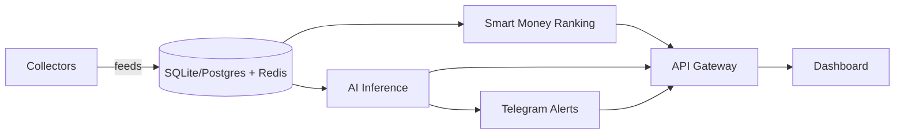

# HyperPulse Architecture

## Overview

HyperPulse is a data intelligence platform built on top of Hyperliquid.

The system continuously collects trading activities, market signals, and liquidation events.

AI services generate insights and inferred trader strategies.

---

## Product Goals & Design Constraints

Canonical product goals also live in [README.md](../README.md#product-goals). Architecture must follow them.

### Goal

Ship **current-moment, high-signal insights** for Hyperliquid trading decisions.

We are **not** building a business around accumulated historical data sales, full-network warehouses, or API tiers that expose raw archives.

### Design constraints

| Constraint | Architectural consequence |
|------------|---------------------------|
| Insight over archive | Pipelines optimize for fresh whale book, rankings, inference, and alerts — not multi-year research warehouses |
| Simple, reliable metrics | Prefer fewer collectors and derived fields we can validate from Hyperliquid `info` / leaderboard / recent trades |
| Actionable output | Ranking, inference, and alert layers exist to compress state into stance, risk, and copy-worthiness |
| Scoped universe | Track top / whale traders deeply rather than index every wallet on the network |
| Persistence is support | DB/Redis store continuity and short-window context; they are not the product surface |

### Page ownership (Dashboard vs Insights)

| Surface | Owns | Does not own |
|---------|------|--------------|
| **Dashboard** | Numeric KPIs (Top3 Consensus, 1h Liq), Market Pulse (OI/Vol/Liq), Prefer teaser cards, Smart vs Rest panel, Market Brief **headline** link only (+ optional 15m pulse one-liner) | Full brief body, suggestions/risks dump |
| **Insights** | Market Brief hero (headline + stance + status + suggestions/risks), optional **15m Pulse** chip on Prefer badge, rule evidence board (+ pulse bar/ticks on Prefer cards), cohort heatmap, collapsed whale style tags | Duplicate Top3/1h KPI strip, pipeline health cards as hero |
| **Liquidations** | 1h/4h/24h strip + Closest Tracked Whales (liq distance%) + zones | Full-network liq heatmap |
| **Trader detail** | Due diligence strip (Watch/Caution/Skip), last-24h fill flow, open book | Full fill-by-fill ledger |

Retail copy: Prefer longs / Prefer shorts / Wait (not Buy/Sell bias).

### LLM usage

| Role | Module | Notes |
|------|--------|-------|
| **Primary** | `app/services/market_brief.py` | Periodic desk Brief from structured snapshot (Top3, coin stances, extreme funding, liq, biggest positions). Cooldown ~20m or hash change. Template fallback always available. |
| **Secondary** | `app/services/inference.py` trader tags | Canonical strategy enum only; Insights shows tags collapsed. |
| **Not LLM** | Prefer long/short evidence cards | Rule votes from whale book + funding + liq |
| **Not LLM** | 15m Pulse (`pulse.py` rules_v1) | Direction probs + auto score vs `market_snapshots`; separate from card `confidence` (vote strength) |

### Feature filter (use when adding work)

Add a feature only if it improves **now-insight** quality for a trader. Reject or defer if it mainly:

- increases metric count without a decision use
- requires full-market historical indexing to be meaningful
- duplicates a dense “scanner” without an interpretation layer

Tracked work items and completion checkboxes: [PRODUCT_BACKLOG.md](./PRODUCT_BACKLOG.md).

---

# High-Level Architecture

                    ┌─────────────────┐
                    │ Hyperliquid API │
                    └────────┬────────┘
                             │
                             ▼

                   ┌──────────────────┐
                   │ Data Collectors  │
                   └────────┬─────────┘
                            │

         ┌──────────────────┼──────────────────┐
         ▼                  ▼                  ▼

 ┌─────────────┐   ┌─────────────┐   ┌─────────────┐
 │ Trader Data │   │ Market Data │   │ Event Data  │
 └──────┬──────┘   └──────┬──────┘   └──────┬──────┘
        │                 │                 │
        └─────────────────┼─────────────────┘
                          ▼

                 ┌─────────────────┐
                 │ PostgreSQL      │
                 └──────┬──────────┘
                        │
                        ▼

                 ┌─────────────────┐
                 │ Feature Engine  │
                 └──────┬──────────┘
                        │
        ┌───────────────┼───────────────┐
        ▼               ▼               ▼

┌─────────────┐ ┌─────────────┐ ┌─────────────┐
│ Whale AI    │ │ Liquidation │ │ Ranking AI  │
│ Engine      │ │ Engine      │ │ Engine      │
└──────┬──────┘ └──────┬──────┘ └──────┬──────┘
       │               │               │
       └───────────────┼───────────────┘
                       ▼

              ┌───────────────────┐
              │ LLM Intelligence  │
              └─────────┬─────────┘
                        │
                        ▼

              ┌───────────────────┐
              │ API Gateway       │
              └─────────┬─────────┘
                        │

       ┌────────────────┼─────────────────┐
       ▼                ▼                 ▼

┌─────────────┐ ┌─────────────┐ ┌─────────────┐
│ Dashboard   │ │ Telegram    │ │ REST API    │
└─────────────┘ └─────────────┘ └─────────────┘

---

# Collector Layer

## Trader Collector

Collect:

- account state
- positions
- fills
- leverage
- realized pnl
- unrealized pnl

Frequency:

- websocket
- 5 second polling fallback

---

## Market Collector

Collect:

- price
- funding
- open interest
- volume
- volatility

Frequency:

- realtime

---

## Liquidation Collector

Collect:

- liquidation events
- liquidation size
- liquidation side

Frequency:

- realtime

---

# Database Schema

## traders

| field | type |
|---------|---------|
| address | text |
| pnl | numeric |
| win_rate | float |
| rank | integer |

---

## positions

| field | type |
|---------|---------|
| trader_id | uuid |
| asset | text |
| side | text |
| entry_price | numeric |
| exit_price | numeric |
| leverage | numeric |

---

## liquidations

| field | type |
|---------|---------|
| asset | text |
| side | text |
| size | numeric |
| timestamp | timestamptz |

---

# Feature Engine

Purpose:

Convert raw events into AI-ready signals.

Examples:

- trader win rate
- average holding time
- risk score
- leverage profile
- strategy profile
- liquidation density
- liquidation clusters

---

# Whale Intelligence Engine

Produces:

- Whale Alerts
- Position Reports
- Trader Profiles

Example Output

Trader: 0x123

Performance

- Win Rate: 72%
- Avg Hold Time: 12h

Behavior

- Momentum trader
- Uses pyramiding
- Prefers ETH and BTC

Confidence Score

81%

---

# Liquidation Engine

Produces:

- Heatmaps
- Cluster Detection
- Squeeze Detection

Signals

- Long squeeze risk
- Short squeeze risk
- High leverage zones

---

# AI Strategy Inference

Inputs

- Position history
- Market conditions
- Funding history
- Open interest

Outputs

- Strategy classification (canonical enum via `canonicalize_strategy`)
- Trading style
- Risk profile

Possible classifications

- Speculative, Directional, Diversified, Scalping, Momentum
- Mean Reversion, Funding Arbitrage, Swing Trading, Trend Following, Mixed

# Market Brief

Structured snapshot → optional LLM JSON → validate against snapshot allowlist → template fallback.

- Snapshot: tape (mark, vs prev day %, funding as Hyperliquid 1h rate, OI/vol for status), Top3 consensus (+ per_asset book), book_wide, coin stances, top3_funding, extreme funding, sampled liq 1h/24h (plus per-asset), biggest positions, coverage
- Output: `headline` (no Prefer), `digest` (tape / Positioning / Read / Note + coverage Low/Medium/High), `tldr` (dashboard teaser), `stance`, `suggestions`, `risks`, `stale`, `tab_assets`, `asset`
- API: `GET /api/v2/insights/brief` and `?asset=BTC` (coin = template + same digest rules)
- Persistence: `market_briefs` latest row (market-wide only) + `store.market_brief`
- Runs **before** per-trader LLM in the inference pipeline so Brief does not compete for budget on failure paths

---

# Alert System

Supported Channels

- Telegram
- Discord
- Email
- Push Notifications

Triggers

- Whale Entry
- Whale Exit
- Large Liquidation
- Squeeze Risk

---

# MVP Scope

Included

- Top 100 trader tracking
- Whale alerts
- Liquidation radar
- Telegram alerts
- AI summaries

Excluded

- Copy trading
- Portfolio management
- Automated execution

---

# Phase 2 Implementation

Phase 2 wires collectors, persistence, ranking, inference, and alerts into a background pipeline.



## Runtime modules

| Module | Responsibility |
|--------|----------------|
| `app/collectors/hyperliquid.py` | Pull Hyperliquid meta/asset contexts; simulate trader ticks when live account feeds are unavailable |
| `app/collectors/scheduler.py` | Async loops for collect / infer / rank |
| `app/services/store.py` | In-memory state + SQLAlchemy persistence |
| `app/services/ranking.py` | Smart money composite score |
| `app/services/inference.py` | Rule evidence cards + secondary trader strategy tags |
| `app/services/market_brief.py` | Market Brief snapshot, LLM/template generation, validation |
| `app/services/brief_schedule.py` | Telegram Brief cadence: Asia 09:00 + US 09:00, once per slot |
| `app/services/alerts.py` | Telegram delivery or local queue |
| `app/routers/v2.py` | Rankings, insights, brief, inferences, alerts, pipeline status |

## Persistence

Default local database is SQLite (`hyperpulse.db`). Tables:

- `traders`
- `positions`
- `liquidations`
- `inference_results`
- `alerts`
- `market_briefs` (latest Market Brief for restart continuity)

Redis is optional. Cache falls back to process memory when Redis is down.

## Ranking formula

```
smart_money_score =
  win_rate * 0.35 +
  momentum * 0.25 +
  consistency * 0.25 +
  risk_adjustment * 0.15
```

## Alert triggers

- Whale entry/exit above confidence and size thresholds
- Large liquidation zones (squeeze risk)
- High-confidence strategy inference updates

Without `TELEGRAM_BOT_TOKEN` / `TELEGRAM_CHAT_ID`, alerts are stored with status `queued`.

---

# Future Vision

HyperPulse evolves from:

Data Platform

→ Intelligence Platform

→ AI Trading Research Platform

→ Autonomous Market Analyst
